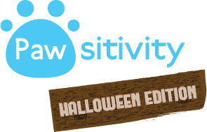

# Pawsitivity

### What is this repository for? ###
* Quick Summary
    * This repositroy holds our cute and cuddly encourager app! This Android application uses cute cats to give out motivational qoutes to help light up one's day.

* Version
    * 1.0

### How do I get set up? ###

This project works with the Android Studio IDE.
Clone the repository and open up Android Studio.
Build an unsigned APK to quickley test the application on your
Android device or run it through the emulator.
Connect to the Pawsitivity API to make calls to the MongoDB database on Heroku.
Link to Pawsitivity-API: https://github.com/yeejkoobt/Pawsitivity-API.git

* Configuration

* Dependencies

* Database configuration
    * Uses a MongoDB database hosted by Heroku.

* How to run tests
* No tests currently.
    * Would like to explore some testing frameworks like Junit.

* Deployment instructions
    * Deployment to the Google Playstore has not yet been discussed.

### Contribution guidelines ###

* Writing tests
* Code review
* Other guidelines
    * Never push directly to master unless it is the initial commit (which has already been done).
Use feature branches to implement changes to the application.
### Who do I talk to? ###

* Repo owner or admin
    * Yeejkoob Thao - yeejkoobt@gmail.com

* Other community or team contact
    * Kevin Lee
    * Lily Li
    * Edwin Villatoro
